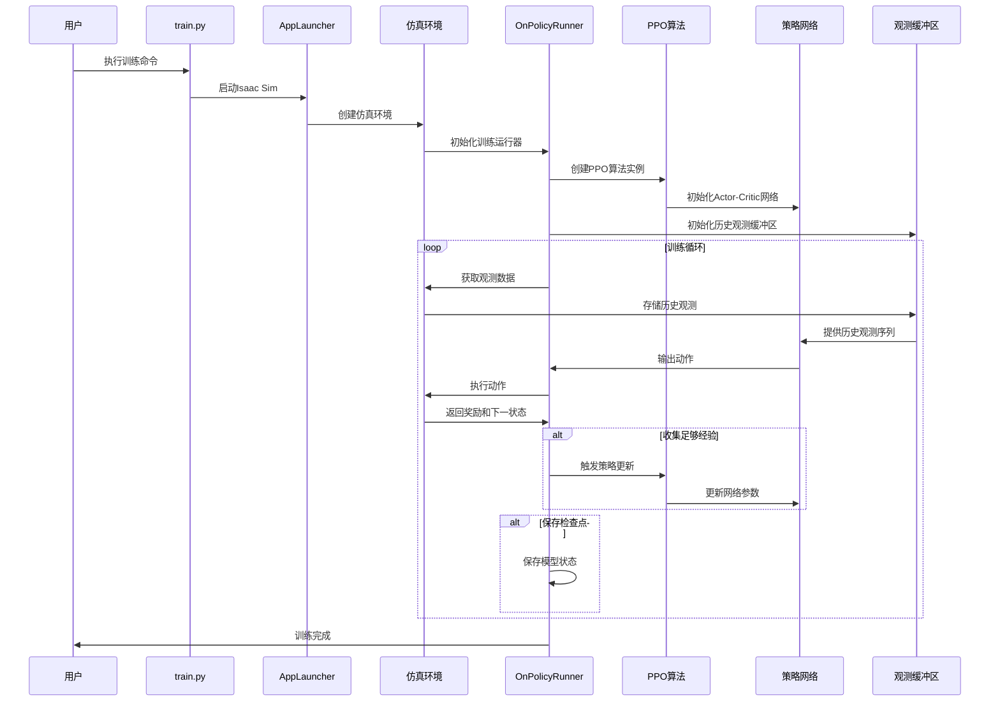
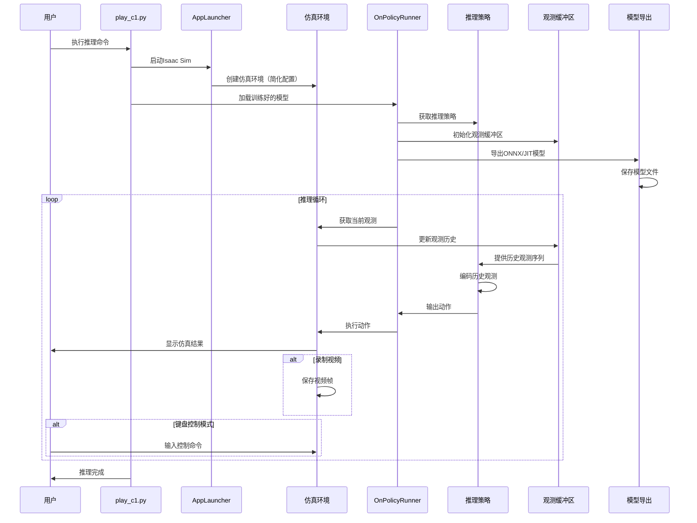
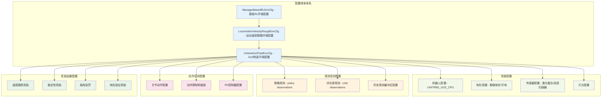
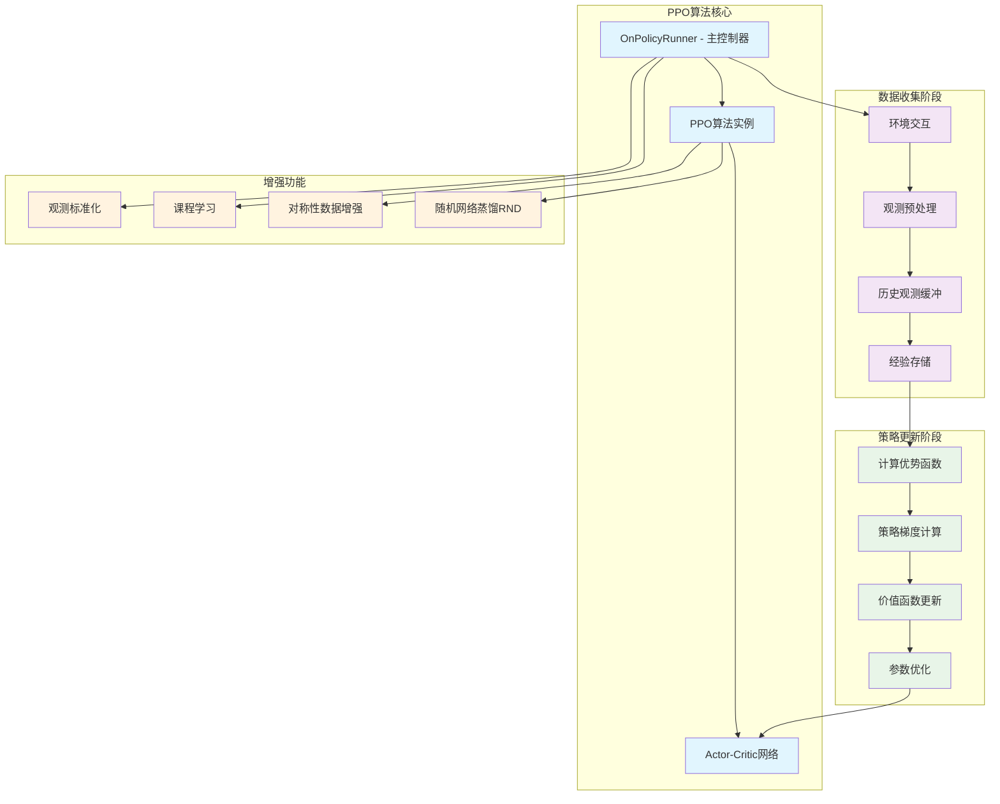
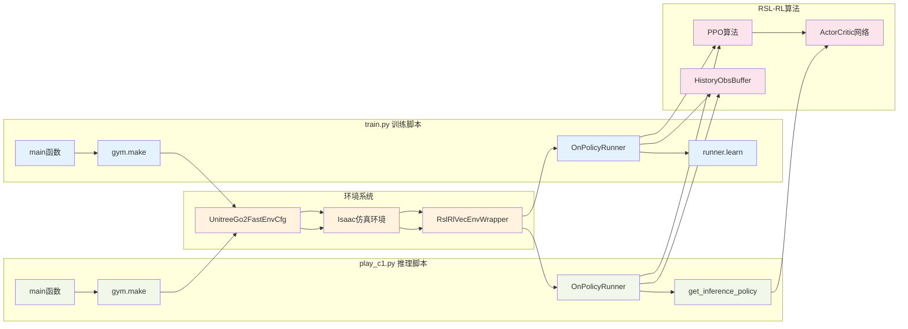
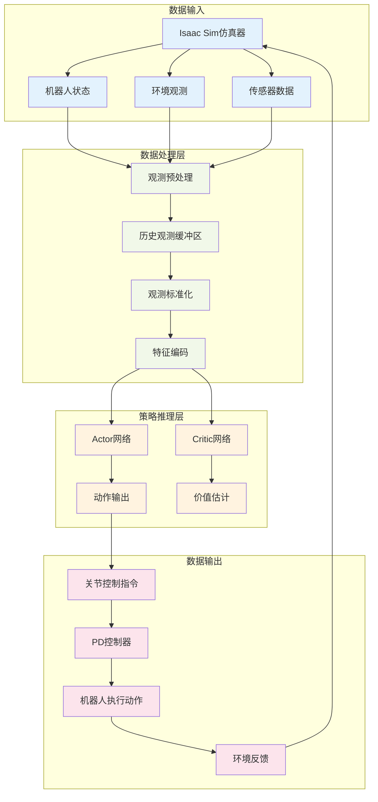

# Isaac-Lab 项目运行流程图详解

## 项目整体架构流程图

```mermaid
graph TB
    %% 主程序入口
    subgraph "主程序入口"
        A[train.py - 训练脚本] 
        B[play_c1.py - 推理脚本]
        C[usage.md - 使用说明]
    end
    
    %% Isaac Lab 框架层
    subgraph "Isaac Lab 框架层"
        D[AppLauncher - 应用启动器]
        E[Isaac Sim - 仿真引擎]
        F[gymnasium.make() - 环境创建]
    end
    
    %% 环境配置层
    subgraph "环境配置层"
        G[UnitreeGo2FastEnvCfg - Go2配置]
        H[LocomotionVelocityRoughEnvCfg - 基础配置]
        I[环境参数设置]
    end
    
    %% RSL-RL算法层
    subgraph "RSL-RL算法层"
        J[OnPolicyRunner - 训练运行器]
        K[PPO算法]
        L[ActorCritic - 策略网络]
        M[RslRlVecEnvWrapper - 环境包装器]
    end
    
    %% 机器人资产层
    subgraph "机器人资产层"
        N[UNITREE_GO2_CFG - 机器人配置]
        O[关节配置]
        P[传感器配置]
    end
    
    %% 数据存储层
    subgraph "数据存储层"
        Q[HistoryObsBuffer - 历史观测缓冲区]
        R[经验回放缓冲区]
        S[模型检查点]
    end
    
    %% 连接关系
    A --> D
    B --> D
    D --> E
    E --> F
    F --> G
    G --> H
    G --> I
    F --> M
    M --> J
    J --> K
    K --> L
    J --> Q
    J --> R
    J --> S
    G --> N
    N --> O
    N --> P
    
    %% 样式定义
    classDef mainProgram fill:#e1f5fe
    classDef framework fill:#f3e5f5
    classDef config fill:#e8f5e8
    classDef algorithm fill:#fff3e0
    classDef assets fill:#fce4ec
    classDef storage fill:#f1f8e9
    
    class A,B,C mainProgram
    class D,E,F framework
    class G,H,I config
    class J,K,L,M algorithm
    class N,O,P assets
    class Q,R,S storage
```

## 训练流程详细图



## 推理流程详细图



## 环境配置系统流程图



## RSL-RL算法内部流程图



## 关键接口调用关系图



## 数据流向图



## 总结

该项目是一个完整的四足机器人强化学习训练和推理系统：

1. **训练流程**：从环境配置开始，通过RSL-RL算法训练Go2机器人的运动策略
2. **推理流程**：加载训练好的模型，在仿真环境中进行实时推理和控制
3. **模块化设计**：清晰的层次结构，便于维护和扩展
4. **数据流向**：从仿真器到策略网络再到控制执行的完整闭环

关键特点：
- 支持历史观测缓冲区，提升时序决策能力
- 模块化的环境配置系统，便于适配不同机器人
- 完整的训练和推理工具链
- 丰富的传感器支持（激光雷达、高度扫描器等）